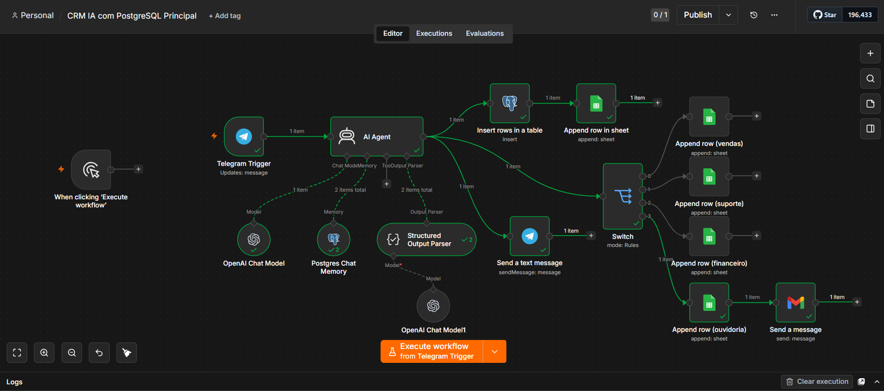

# ⚡ CRM Inteligente Automatizado com IA (n8n)

Desenvolvi um sistema de CRM inteligente e atrativo no **n8n** para gestão automatizada de leads e atendimento. O fluxo é acionado via chat (Telegram), processa as mensagens com Inteligência Artificial, classifica o atendimento, armazena os dados em banco de dados relacional e alimenta um painel analítico em tempo real.

---

## 📸 Visão Geral do Fluxo

---

## 🎯 Solução e Recursos

* **Atendimento via Chat (Telegram Trigger):** Captura instantânea das mensagens recebidas pelo canal de atendimento.
* **Classificação e Qualificação por IA:** Utilização de agente de IA e parser estruturado para analisar a intenção do cliente e categorizar o lead automaticamente.
* **Memória de Conversa:** Gerenciamento do histórico da conversa utilizando Postgres Chat Memory para respostas contextualizadas.
* **Armazenamento em Banco de Dados (SQL):** Inserção centralizada e estruturada de cada atendimento em tabelas no **PostgreSQL**.
* **Dashboard em Tempo Real (Looker Studio / Data Studio):** Envio dos dados para o ecossistema Google, alimentando dashboards visuais para tomada de decisão e acompanhamento de métricas do CRM.
* **Encaminhamento Inteligente:** Roteamento de mensagens (vendas, suporte, financeiro, ouvidoria) e envio de e-mails de notificação.

---

## 🛠️ Tecnologias Utilizadas

* **n8n** — Plataforma principal de orquestração do fluxo
* **Telegram Bot API** — Interface de chat trigger para entrada de dados
* **OpenAI (GPT) & AI Agent** — Processamento de linguagem natural e estruturação de saída
* **PostgreSQL** — Banco de dados relacional para registro dos leads e memória do chat
* **Google Sheets & Looker Studio (Data Studio)** — Camada de dados e visualização de dashboards analíticos
* **Gmail** — Notificação e envio de e-mails automatizados

---

## 📁 Arquivos do Projeto

* 📄 **Apresentação em PDF:** [Acessar Documentação](Projeto_N8N_CRM_Inteligente_com_IA.pdf)
* ⚙️ **Workflow para Importação:** [Baixar Workflow (.json)](workflow-crm-n8n.json)
